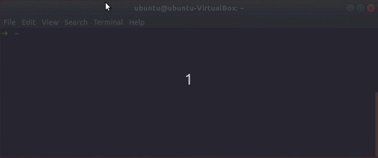
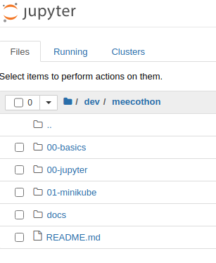

# MeeCoThon

Collection of all MeeCoThon topics

<!-- START doctoc generated TOC please keep comment here to allow auto update -->
<!-- DON'T EDIT THIS SECTION, INSTEAD RE-RUN doctoc TO UPDATE -->
## Contents

<!-- END doctoc generated TOC please keep comment here to allow auto update -->

## Requirements & recommendations for all topics

- Ubuntu is the recommended operating system for that
- docker & git must be installed
- Jupyter Notebook with the installed bash-kernel
  - otherwise you have to copy the bash-scripts into your local terminal

## Prepared VM

### Operating system

```
   Static hostname: ubuntu-VirtualBox
         Icon name: computer-vm
           Chassis: vm
        Machine ID: 8ff7b07b4a334d449ac9637419d6f215
           Boot ID: 44d1d20fdeb74bb1b5db8b0f6e16437a
    Virtualization: oracle
  Operating System: Ubuntu 18.04.5 LTS
            Kernel: Linux 5.4.0-42-generic
      Architecture: x86-64
```

### VM Host

The prepared VM is created with [VirtualBox 6.1.2](https://www.virtualbox.org/). You can download the correct version [here](https://download.virtualbox.org/virtualbox/6.1.12/VirtualBox-6.1.12-139181-Win.exe)

You can use this, VMware Player or Hyper-V. With Hyper-V you have to do some manual steps because of the missing "Open Virtualization Format" support.

**If you use VirtualBox or VMware Player make sure to deactivate Hyper-V**

## Cloning this repository



## 0 Basics

### Kubernetes

For most of the showcases we use Kubernetes. Therefore it would be an asset to know the basic [terminology](https://kubernetes.io/de/docs/reference/glossary/?fundamental=true) of it.

Slide: https://docs.google.com/presentation/d/1L4HI5Ywi-jxAuVp5raP7yq7VL8XaqXXh5Xxuq7CwJ-M/

### Jupyter Notebook

The Jupyter Notebook is an open-source web application that allows you to create and share documents that contain live code, equations, visualizations and narrative text.



If you use the prepared VM you can start jupyter via `cd ~ && source jupyter_project_env/bin/activate && jupyter notebook`. This will open a webbrowser with the content of your drive. Now you can open the folder where you have cloned this repository into and select the current topic.

## 1 Minikube

Slide: https://docs.google.com/presentation/d/1qkK2dsEX5CNZL6-nrWQuywER3Wd7mlPzC1lSQdw5_Rc

### Requirements

- This topic expects a host which is able to run minikube and microk8s
- minikube, kubectl & helm 3 must be installed
- for microk8s: snap is required

### microk8s option

As a breakout session we are going to use microk8s for the same sample service we use(d) in the minikube session.

```bash
sudo snap install microk8s --classic --channel=1.18/stable
sudo usermod -a -G microk8s $USER
sudo chown -f -R $USER ~/.kube
# relogin or restart needed
su - $USER
microk8s status --wait-ready
```

### Useful commands for this session

Continously execute the following command and show the result

```
watch -n <seconds> <cmd>
```

Format JSON (with optional filter)

```
<cmd-which-retuns-json> | jq
```

Show all resources of the defined types for the given `<namespace>`.

```
kubectl get pods,deployments,services,ingress -o wide --namespace <namespace>
```

Show logs for corresponding pods.

```
kubectl logs -l label=selector --namespace <namespace>
```

Forward traffic to a pod|deployment|service without the need of an ingress

```
kubectl port-forward service/my-service-to-expose --namespace <namespace> <port>
```

Show all HELM installations

```
helm list -A
```